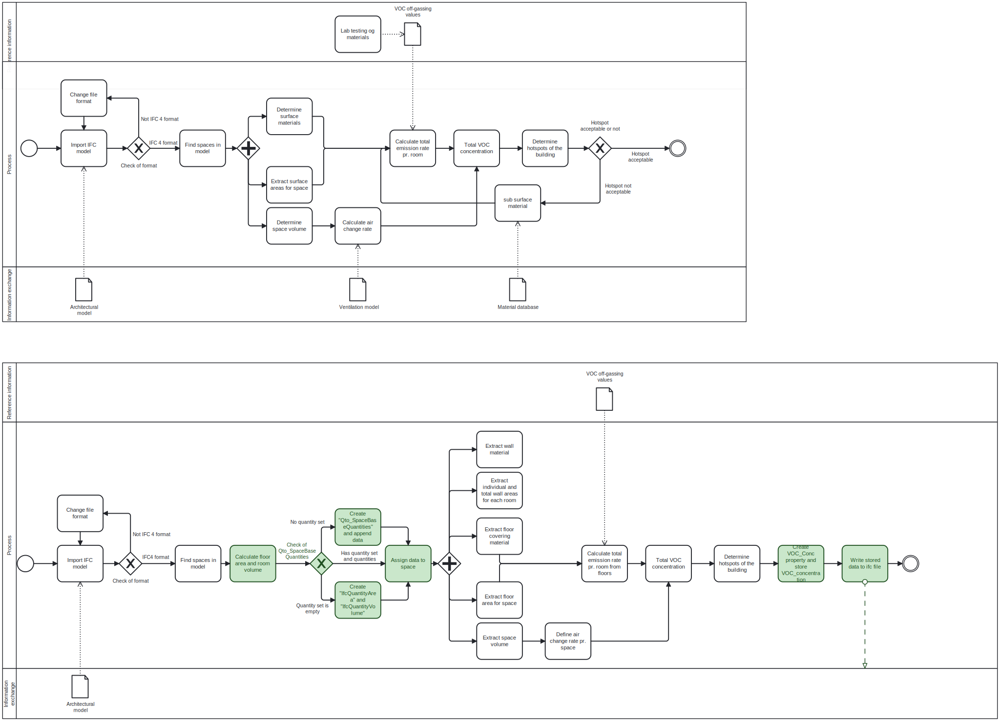

# Using IFC to Determine Where Healthy Materials Should Be a Prioritiy for Improved IEQ in a Building

## Flooring VOC Emissions and Space Concentrations

### Use case
#### Goal
The goal of the script is to support the design phase by computing the Volatile Organic Compounds (VOCs) concentration for each space in a building model based on: the off-gassing from the materials in the room, their surface area, and the estimated air change rate of the space. This makes it possible to identify problematic spaces and improvement potentials, since the concentration of VOCs in a room should be limited to ensure a healthy and good indoor air quality.

#### Model use
In order for the tool to work a Ifc model has to be established with certain data (described further in 'Realized tool'). The tool therefore relies on proper modelling from engineers or draftsmen and the model to be established. In order to perform calculation in the tool, a database with off-gassing values have to be obtained. This is going to require extensive off-gas testing of materials so that there is a database of input for these calculations. 

The program is possible to be used by anyone working in the built environment space who is interested in improving decision making for material selection. More specifically can the tool be utilized by fx.: 
- Project managers in the building industry trying to make cost effective decisions while maintaining building health

- Architects focused on designing material and health conscious spaces

- Engineers involved in performing building simulations and other analyses

The tool is designed to be used iteratively, using the possibility to swap out materials of the surfaces from the material library. This allows for optimization of the model based on the VOC concentration in the spaces. This could be further paired with fx. a cost analysis or LCA in order to obtain the most holistic solution. 

### Proposition of tool
##### Ideal tool

#### Realized tool
The script runs a loop through all unique spaces in an IFC file to retrieve data for each space in a building including space name, floor- and ceiling areas, volumes, and the floor covering in a space. The current script calculates only VOC off-gassing from the floor covering, but would (if expanded) be calculated for all walls, floors, ceilings, and furnitures in the space. The script, therefore, additionally runs a loop that goes through all spaces to determine the bounding wall elements and their materials. The information is not yet further utilized, but is made available if necessary. 

Disciplinary expertise in indoor air quality (IAQ) and ventilation is required to perform an analysis and assessment of VOC concentrations in the spaces based on the information extracted from the IFC. A list with off-gassing rates for particular flooring materials has been created and is utilized in calculations for VOC concentrations in the spaces.

The emission rate for all flooring in a room is then determined by multiplying the space area and the specific emission rate corresponding to the floor covering in the space. In this particular script, an assumed ventilation rate was used along with the extracted space volume to determine the air change rate in the space requiring expert knowledge of necessary ventilation rates for the spaces and the influence of the air exchange rate. Once the space emission rate and air change rate are determined, the VOC concentration in a space can be estimated and is printed. Plots and a 'Top 10' list are generated to easily compare VOC 'hotspots' in the building.

A schematic of the designed tool can be seen in Figure

###### IFC Input data:
In order for the script to work, some data has to be defined and stored in the model. The tool is based on the standardized format IFC 4. 
The needed data in order to calculate the total VOC emission of a space is: 
- Rooms = Stored as IfcSpace

- Room identifier = space.Name

- Room type = space.LongName

- Flooring type = Stored in property set 'Pset_SpaceCoveringRequirements' as 'FloorCovering' linked to the IfcSpace

Some inputs are needed in order to showcase the possibilities of retriving the wall area and material, but these inputs are not needed in order to calculate the final VOC calculation. 
These inputs are: 
- Walls = Stored as IfcWall, and related to the spaces as 'BoundedBy'. 

- Wall material = Stored in either IfcMaterial or IfcMaterialConstituentSet which is associated to the wall. 

- Wall area = Stored in quantity set 'Qto_WallBaseQuantities' as 'IfcQuantityArea' named as 'NetSideArea'

- Ceiling area = Stored in quantitity set 'Qto_SpaceBasedQuantities' as 'IfcQuantityArea' linked to the IfcSpace and named 'NetCeilingArea'. 

###### External input data:
Some data for the calculations are retrieved from other sources than the IFC model. This concerns the VOC off-gassing values for a self-constructed list of materials. 

- Specific Emission Rate (SER) of materials stored in as an xlsx file. 

###### External output data: 
The script outputs two output files stored in an output folder. The output are: 

- Dataframe.xlsx = file containing the VOC concentration calculated for each space as well as floor covering type, floor area and room volume. 

- LLYN - ARK_Qto_out.ifc = the final, manipulated ifc model with the added details performed by the script.

### The value of the tool
The value in this tool is that it provides any constituent in the building design process with an easy tool to perform analysis on the off-gassing of materials in a building based on the building's IFC file. This means that as long as there is in IFC file with spaces and quantities assigned and information on off-gassing for specific materials, concentration analysis can be conducted from the early design stages to generate improved iterations.
The tool can therefore support the early design stage by quickly getting an overview of the problematic areas in the building, without any additional calculations needed, if the needed data is supplied for the tool. 

DGNB certification already requires testing of TVOC and formaldehyde concentration in a building, and the tool could therefore ensure documentation for DGNB points, or avoid penalties for the future, thereby making it easier to achieve better scores. 

The tool has societal value by ensuring the counstruction of healthy buildings. The tool contributes to assessment and improvement of the indoor environmental quality (IEQ), helping to create better spaces for occupants early in the design process. The occupants will therefore spend their time in less toxic buildings, avoid the negative healthy impacts of VOC's in the indoor air. 

##### What needs advacement for this tool to be widely and easily used?

Many iterations and improvements could be made to this tool so that more materials in a building can be evaluated. . Further advancements may also be to include off-gassing from walls, ceilings and furniture to the calculations, and the ability to substitute materials in the calculation in order to assess material changes in the room. To further improve the calculations, proper modelling must also be done to include e.g. furniture and needed quantities assigned to all spaces in order to retrieve the surface areas.

